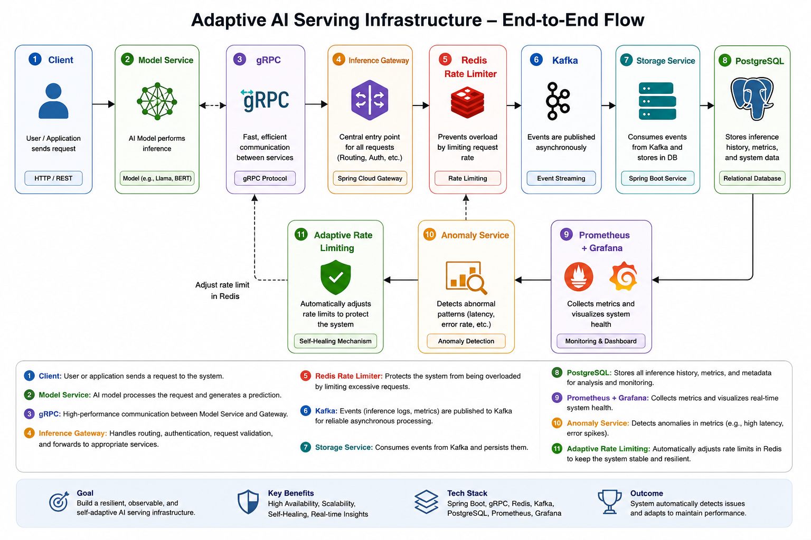

# System Architecture

The Adaptive AI Serving Infrastructure handles model inference requests end to end, from API entry to monitoring and adaptive operations.

*Figure 1: End-to-End Architecture of the Adaptive AI Serving Infrastructure.*

## End-to-End Flow

1. **Client -> Inference Gateway**  
   Client applications send inference requests to the gateway, which validates and routes traffic.

2. **Gateway -> Model Serving Layer**  
   The serving layer executes model inference and returns prediction results.

3. **Telemetry Emission**  
   Request metrics, model latency, error rates, and service health signals are emitted continuously.

4. **Monitoring and Storage**  
   Observability components collect, visualize, and store system and model-serving data.

5. **Adaptive Control Loop**  
   Based on telemetry trends (for example, high latency or failures), the platform can trigger adaptive actions such as scaling or routing adjustments.
